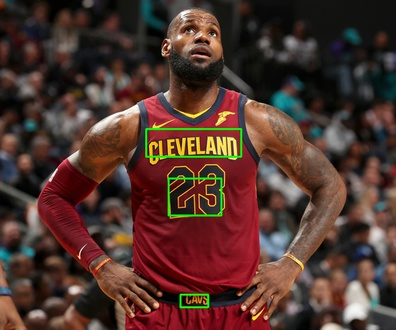
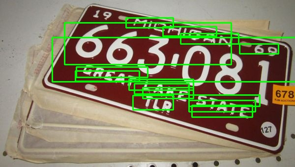
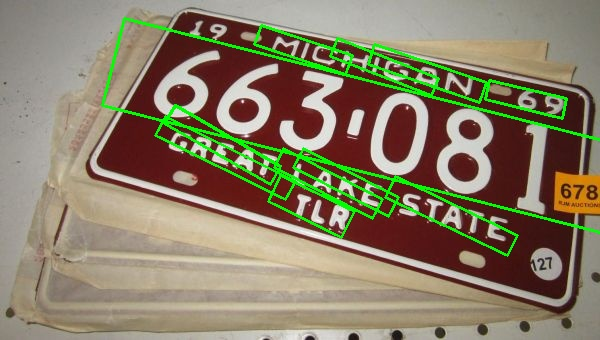

# OpenCV-text-detection

This is a derivative of [pyimagesearch.com OpenCV-text-detection](https://www.pyimagesearch.com/2018/08/20/OpenCV-text-detection-east-text-detector/) and the [OpenCV text detection c++ example](https://docs.OpenCV.org/master/db/da4/samples_2dnn_2text_detection_8cpp-example.html)

This code began as an attempt to rotate the rectangles found by EAST.  The pyimagesearch code doesn't rotate the rectangles due to a limitation in the OpenCV Python bindings -- specifically, there isn't a NMSBoxes call for rotated rectangles (this turns out to be a bigger problem)

[EAST](https://arxiv.org/abs/1704.03155) Efficient and Accurate Scene Text detection pipeline.  Adrian's post does a great job explaining EAST.  In summary, EAST detects text in an image (or video) and provides geometry and confidence scores for each block of text it detects.  Its worth noting that:

* The geometry of the rectangles is given as offsetX, offsetY, top, right, bottom, left, theta.  
* Top is the distance from the offset point to the top of the rectangle, right is the distance from the offset point to the right edge of the rectangle and so on.  The offset point is most likey **not** the center of the rectangle. 
* The rectangle is rotated around **the offset point** by theta radians.

While the EAST paper is pretty clear about determining the positioning and size of the rectangle, its not very clear about the rotation point for the rectangle.  I used the offset point as it appeared to provide the best visual results.

## Modifications
In the PyImageSearch example code, Non Maximal Suppression (NMS) is performed on the results provided by EAST on the unrotated rectangles.  The unrotated rectangles returned by NMS are then drawn on the original image.

Initially, I modified the code to rotate the rectangles returned by NMS and then drawing them on the original image.

|Unrotated|Rotated|
|:---:|:---:|
| | |

## Challenge
With my assumption that each rectangle returned by EAST was to be rotated around its offset, I wanted to see how the individual rotations would impact the results of NMS.  That is, rather than applying NMS to the EAST rectangles and then drawing them rotated, could I rotate the rectangles and then run them through NMS?  This became a challenge as the PyImageSearch imutils and OpenCV Python bindings don't support NMS applied to rectangles rotated about an arbitrary point.

The code in this repo is a result of that challenge.  I settled on nms.py that has three functions:


* **nms\_rboxes(rotated_rects, scores)**
	
	*rotated\_rects* is a list of rotated rectangles described by ((cx, cy), (w,h), deg) where (cx, cy) is the center of the rectangle, (w,h) are the width and height and deg is the rotation angle *in degrees* about the center.  The format for *rrects* was chosen to match the OpenCV c++ implementation of [NMSBoxes](https://docs.opencv.org/master/d6/d0f/group__dnn.html#ga9d118d70a1659af729d01b10233213ee). 
	
	*scores* is the corresponding list of confidence scores for the rrects.  

	This function converts the list of rotated rectangles into a list of polygons (contours) described by its verticies and passed to nms\_polygons.
	
	REturns a list of indicies of the highest scoring, non-overlapping *rotated\_rects*.
	
* **nms\_polygons(polys, scores)**

	*polys* is a list of polygons, each described by its verticies
	
	*scores* is the corresponding list of confidence scores for the rrects. 
	
	Returns a list of indicies of the highest scoring, non-overlapping *polys*.

* **nms\_rects(rects, scores)**

	*rects* is a list of unrotated, upright rectangles each described by (x, y, w, h) where x,y is the upper left corner of the rectangle and w, h are its width and height.
	
	*scores* is the corresponding list of confidence scores for the rects.
	
	Returns a list of indicies of the highest scoring, non-overlapping *rects*.
	
	
Each of the above functions has an optional named parameter *nms\_function* and accept additional parameters that are received as **kwargs.

* *nms\_function* if specified, must be one of *felzenswalb*, *malisiewicz* or *fast*.  If omitted, defaults to *malisiewicz*.  Note that the value for *nms\_function* is not quoted.

 The *felzenswalb* implementation was transmogrified from [this PyImageSearch blog post](https://www.pyimagesearch.com/2014/11/17/non-maximum-suppression-object-detection-python/).
 
 ```python
 indicies = nms_polygons(polygons, scores, nms_function=felzenswalb)
 ```

 The *malisiewicz* implementation was transmogrified from [this PyImageSearch blog post](https://www.pyimagesearch.com/2015/02/16/faster-non-maximum-suppression-python/).  Per Adrian's post, this implementation is *much* faster than felzenswalb but be aware that when running nms_rrects or nms_polygons, some of the vectorization is lost :( and performance suffers a bit. 
 
 ```python
 indicies = nms_polygons(polygons, scores, nms_function=malisiewicz)
 ```
 
 The *fast* implmentation is an approximation of the [OpenCV c++ NMSFAST](https://github.com/opencv/opencv/blob/ee1e1ce377aa61ddea47a6c2114f99951153bb4f/modules/dnn/src/nms.inl.hpp#L67) routine. Which, as the inline comments there will tell you, was inspired by [Piotr Dollar's NMS implementation in EdgeBox](https://goo.gl/jV3JYS).
 
 ```python
 indicies = nms_polygons(polygons, scores, nms_function=fast)
 ``` 
 
* *kwargs* are used to pass in custom values.  All of these are optional and if not specified, default values are used:

 *nms\_threshold*: The value used for making NMS overlap comparisons. Defaults to 0.4 if omitted.
 
 *score\_threshold*: The value used to cull out rectangles/polygons based on their associated score.  Defaults to 0.3.
 
 *top\_k*: Used to truncate the scores (after sorting) to include only the top\_k scores.  If top\_k is 0, all scores are included.  Default value is 0.
 
 *eta* is only applicable for *fast* and is a coefficient in the adaptive threshold formula: nms\_thresholdi=eta⋅nms\_threshold.  The default value is 1.0
 
 As an example of what's possible:
 
 ```python
 indicies = nms_polygons(polygons, scores, nms_function=fast, nms_threshold=0.45, eta=0.9, score_threshold=0.6, top_k=100)
 ```
 
## Results
 
 As you might expect, performing NMS on the rotated rectangles doesn't really change much on images with sparse text like the Lebron images above.  However, with busier images there can be a difference -- EAST doesn't perform well with the image below, but it's instrumental for examining the NMS results.
 

|Unrotated|Rotated|
|:---:|:---:|
|||
|Malisiewicz (above) 15 Rectangles | 11 Rectangles|
|Felzenswalb 10 Rectangles | 9 Rectangles|
|Fast 10 Rectangles | 9 Rectangles|


## Run the Code

This code was developed and run on Python 3.7 and OpenCV 4.0.0-pre on OSX.  You can find helpful instructions for setting up this environment on [yet another PyImageSearch blog post](https://www.pyimagesearch.com/2018/08/17/install-opencv-4-on-macos/)

Clone the repo and run:

```python
python text_detection.py --east frozen_east_text_detection.pb --image images/lebron_james.jpg
``` 

I have not implemented *text\_detection\_video.py*

## Thanks
A big thanks to Adrian Rosebrock ([@PyImageSearch](https://twitter.com/@PyImageSearch)) at [PyImageSearch](https://www.pyimagesearch.com) -- he writes some amazing and inspiring content.


